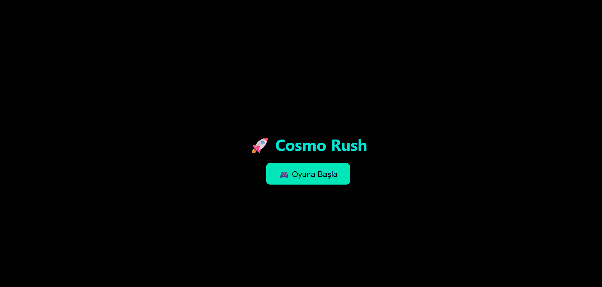
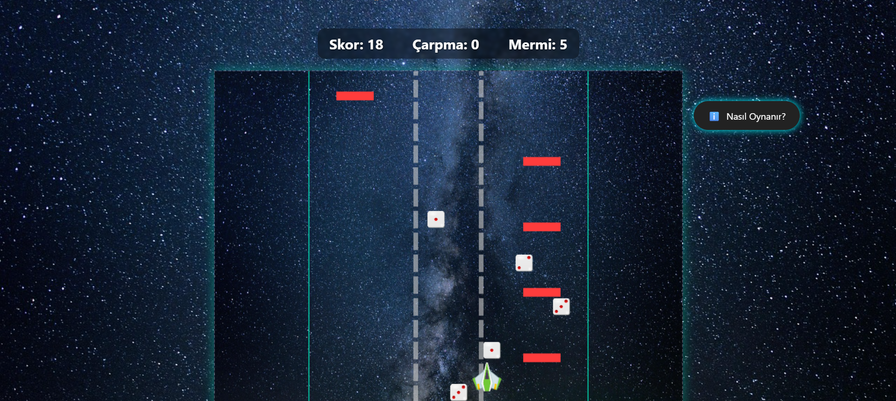
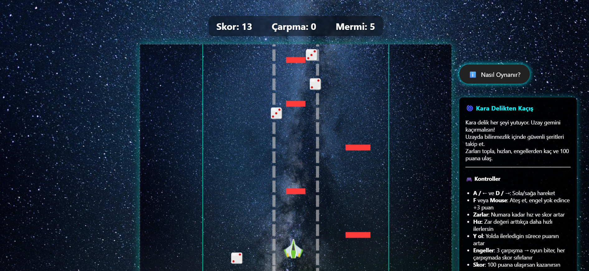
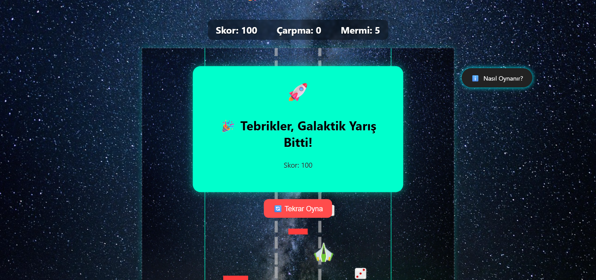
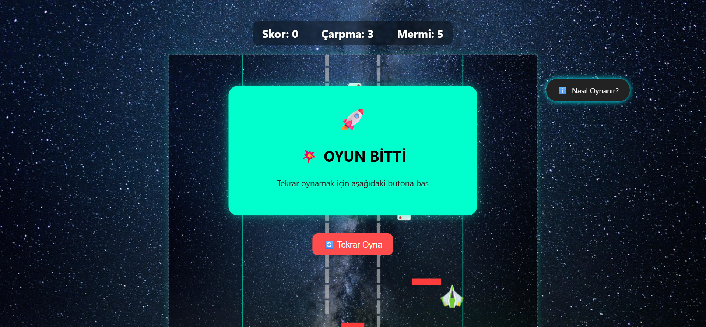

# 🚀 Cosmo Rush

**Cosmo Rush**, uzayın derinliklerinde kara delikten kaçan bir uzay gemisini yönettiğiniz, HTML5 Canvas ve JavaScript ile geliştirilmiş 2 boyutlu bir aksiyon oyunudur. Refleks, hız ve dikkat gerektiren oyun yapısıyla hem eğlenceli hem de zorludur.

---

## 🎯 Oyun Hedefi

Oyundaki temel hedef, oyuncunun bir uzay gemisini kontrol ederek düşen zarları toplamaya çalışması, aynı zamanda rastgele çıkan engellerden kaçınarak hayatta kalmasıdır. Toplanan her zar, 1 ila 3 arasında rastgele bir değer taşır ve bu değer, oyuncunun hareket hızını doğrudan etkiler. Ancak oyundaki önemli bir mekanik şudur: sadece daha önceki hız seviyesinden daha yüksek bir zar gelirse oyuncunun hızı artar; düşük değerli zarlar hızı düşürmez.

Zarların toplanmasıyla birlikte oyun temposu hızlanırken, oyuncunun refleksleri daha da sınanır. Oyuncunun toplam 3 çarpma hakkı vardır. Bir engele çarpıldığında, skor sıfırlanır ve kısa bir süreliğine görünmezlik uygulanır, bu da geçici koruma sağlar. Eğer oyuncu 3 defa engele çarparsa oyun sona erer. Ancak dikkatli, hızlı ve stratejik davranan oyuncular, bu zorlu uzay yolculuğunu başarıyla tamamlayarak 100 puana ulaştığında oyunu kazanı

---

### 🎮 Kontroller

- **← / → veya A / D Tuşları:** Gemi sola ve sağa hareket eder.  
- **🖱️ Fare:** Mermi atışı yapar ve sağ üst köşedeki “ℹ️ Nasıl Oynanır” butonunu açıp kapatır.

---

### 📸 1. Başlangıç Ekranı

---

## 🧩 Mekanikler ve Oynanış Özellikleri

- **Canvas Yapısı:** Tüm görseller canvas üzerine çizilir.
- **FPS Bağımsız Hız:** deltaTime ile cihazdan bağımsız sabit hız.
- **Zar Sistemi:** Toplanan zarın degerine göre hız güncellenir yani her zaman son toplanan zarın degerine göre hızımız belirlenir.
- **Skor:** Zar değeri kadar puan + her 100 frame'de +1 skor mermi ile engel yok edilirse +3puan.
- **Çarpma & Görünmezlik:** 3 can hakkı, çarpınca kısa süreli görünmezlik.
- **Oyun Sonu:** 100 puan = kazanma; 3 çarpma = kaybetme.

---

### 📸 2. Oyun Sırasında Hareket

---

### 📸 3. Zar Toplama Anı

---

### 📸 4. “Nasıl Oynanır” Paneli Açıkken

---

### 📸 5. Oyun Kazanma Ekranı

---

### 📸 6. Oyun Kaybetme Ekranı

---

## 📦 Varlıklar (Assets)

### 🖼️ Görseller (`assets/img/`)
- `assets/img/zar1.png` – Zar 1 görseli  
- `assets/img/zar2.png` – Zar 2 görseli  
- `assets/img/zar3.png` – Zar 3 görseli  
- `assets/img/cosmo.png` – Arka plan görseli  
- `assets/img/player.png` – Uzay gemisi görseli  

#### 📸 Oyun içi sahne görselleri
- `assets/img/foto1.png` – Başlangıç  
- `assets/img/foto2.png` – Oyun hareket  
- `assets/img/foto3.png` – Zar alma  
- `assets/img/foto4.png` – Nasıl oynanır  
- `assets/img/foto5.png` – Kazanma  
- `assets/img/foto6.png` – Kaybetme  

---

## 🔧 Kullanılan Teknolojiler

| Teknoloji        | Açıklama                                      |
|------------------|-----------------------------------------------|
| **HTML5 Canvas** | Oyun grafikleri ve çizimler                   |
| **JavaScript**   | Mantık, animasyon, kontrol yapısı             |
| **CSS**          | Görsel düzenlemeler                           |
| **HTML Audio API** | Müzik ve ses efektleri                      |

---

## ✨ Oyun Özellikleri

- 🎲 **Zar Mekaniği:** Zarlar hızınızı artırır, her biri rastgele değer taşır.  
- ⚡ **Hız Yönetimi:** Zar degerine göre hızımız güncellenir.  
- 💥 **Çarpışma Etkisi:** Çarpınca skor sıfırlanır ve kısa süreli koruma başlar.  
- 🎧 **Ses Desteği:** Arka plan müziği ve olay bazlı ses efektleri.  
- ℹ️ **Nasıl Oynanır Paneli:** Açılır/kapanır yardım kutusu.  
- 🏁 **Kazanan/Kaybeden Ekranları:** Oyun sonu görsel desteği.

---

## 🎥 Oynanış Videosu

[📺 Youtube’da İzle](https://www.youtube.com/watch?v=x9k5CtC12d8)

---

## 🌐 Bağlantılar

- 🔗 **Oyunu oynamak için tıklayabilirsiniz:** [https://fatihgoral.github.io/cosmo_rush/](https://fatihgoral.github.io/cosmo_rush/)

